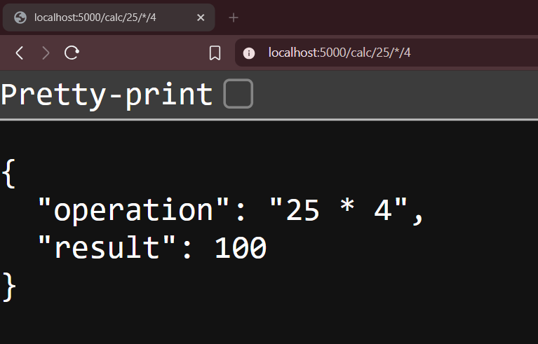
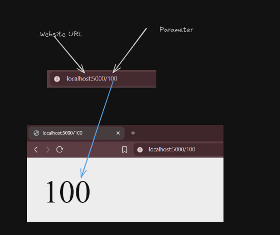

# Level 1
Lets create a calculator app , a simple one
## Task 2

- Fork this repo to your github account then clone it.
```bash
git clone http://github.com/your_username/python_by_doing_1.git
cd python_by_doing_1
pip install -r requirements.txt
```
- Open `app.py` in your editor(vs code or any)
- You have to add a new route like below 
```python
@app.route('/calc/<vals>/<operator>/<vals2>')   
```
- The route should support 3 operators + , - , *  operations 
- For example if you go to `http://localhost:5000/calc/25/*/4` it should print like this

- The format must be 
```json
{
    "operation": "25 * 4",
    "result": 100
    }
```
- If you see this output now run the `check.ps1` file in powershell
```powershell
.\check.ps1
```
- If you see `^_^ Test Passed` you are good to go to next step
- If you see `X_X Test Failed` , check your code again

- Now stop the program using `CTRL+C` 
- Run the following
```bash
git add -A
git stash
```
- Now mark your attendance below like the example
- Now push you changes to your fork 
```bash
git add -A
git commit -m "Level Completed"
git push origin main
```
- Now go to , http://github.com/aruncs31s/python_by_doing_1
- and open a new pull request.

## Attendance 

| Username | Date |
|------|----|
| Arun CS | 04-09-2025| 


## Route parameter parsing
In flask you can get the route parameters like this 
```python
@app.route('/<parameter_name>')
def function_name(parameter_name: str):
    return f"{parameter_name}"
```
And if you go to `http://localhost:5000/any_value` it will print `any_value`
For example if you go to `http://localhost:5000/100` it will print `100`


>[!NOTE] 
> **PORT**
> The default port for flask app is 5000 , thats why you are seeing `http://localhost:5000/` in the url. and `localhost` means your own computer. 
>

---

You can use your normal functions with `flask` for example 
```python
def add(a: int, b: int) -> int:
    return a + b
```
or 
```python
a = " 1 "
b = " 2 "
operator = "+"
result = eval(f"{a} {operator} {b}")
print(result) # 3 
```
You can use `eval` function to evaluate a string as a python expression. 
and if you want to send that as a json response you can use `jsonify` function from `flask` 
```python
from flask import jsonify
 --- IGNORE ---
 return jsonify({
     "operation": f"{vals} {operator} {vals2}",
     "result": result
 })
```
Do not think this is the actuall answer , because you have to parse 3 parameters like `https://localhost:5000/calc/25/*/4` and then do the operation and return the result in json format.

>[!NOTE]
> **JSON**
> JSON stands for JavaScript Object Notation. It is a lightweight data-interchange format that is easy for humans to read and write, and easy for machines to parse and generate. JSON is often used to transmit data between a server and a web application. Its similar to Python dictionaries. 
> - THe json has a key value pair format
> ```json
> {
>     "key": "value",
> }
> ```
> For example 
> ```json
> {
>     "name": "Arun",
>     "age": 25,
>}
>```
> Here `name` and `age` are keys and `Arun` and `25` are values.
